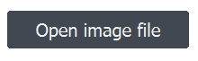
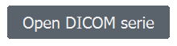

    
# Hesperos plugin for Napari

    TODO : DESCRIPTION

This [napari] plugin was generated with [Cookiecutter] using [@napari]'s [cookiecutter-napari-plugin] template.

   
    
# Table of Contents
- [Installation and Requirements](#installation-and-requirements)
    * [Automatic installation](#automatic-installation)
    * [Manual installation](#manual-installation)
    * [Upgrade Hesperos version](#upgrade-hesperos-version)
- [Hesperos: Manual Segmentation and Correction](#hesperos-manual-segmentation-and-correction)
    * [Load your image](#load-your-image-use-panel-1)
    * [Layer controls](#layer-controls)
    * [Annotate your image](#annotate-your-image-use-panel-2)
    * [Save annotations](#save-annotations-use-panel-3)

    
    
# Installation and Requirements
Hesperos plugin is designed to run on Windows operating system and macOS with Python 3.8, 3.9 or 3.10.
     
## Automatic installation
1. Install [Anaconda] and deselect *Add to PATH*. Note the path where you install anaconda.
    
2. Download only the *script_files* folder, for [Windows](/script_files/for_Windows/) or [Macos](/script_files/for_Windows/).
    
3. Add the Anaconda path in these script files:
    1. <ins>For Windows</ins>: 
    Right click on the .bat files (for [installation](/script_files/for_Windows/install_hesperos_env.bat) and [running](/script_files/for_Windows/run_hesperos.bat)) and select *Modify*. Change *PATH_TO_ADD* with your Anaconda path. Then save changes.
        > for exemple: $ `anaconda_dir=C:\Users\chgodard\anaconda3` 
    2. <ins>For Macos</ins>:
        1. Right click on the .command files (for [installation](/script_files/for_Macos/install_hesperos_env.command) and [running](/script_files/for_Macos/run_hesperos.command)) and select *Open with TextEdit*. Change *PATH_TO_ADD* with your Anaconda path. Then save changes.
            > for exemple: $ `source ~/opt/anaconda3/etc/profile.d/conda.sh ` 
        2. On your terminal allow running of your .command files (change *PATH* with the path of your .command files): 
            > $ `chmod u+x PATH/install_hesperos_env.command `
    
            > $ `chmod u+x PATH/run_hesperos.command `
    
4. Double click on the **install_hesperos_env file** to create a virtual environment in Anaconda with python 3.9 and Napari 0.4.14. /!\ Hesperos plugin is not yet compatible with Napari version superior to 0.4.14.
    
5. Double click on the **run_hesperos file** to run napari from your virtual environment.
    
6. On Napari: 
    1. Go to *Plugins/Install Plugins...*
    2. Search for "hesperos" (it can take a while to load).
    3. Install **hesperos** plugin.
    4. When installation is done, close Napari. A restart of Napari is needed to take in consideration the new installed plugin.
    
7. Double click on the **run_hesperos file** to run Napari.
    
8. On Napari, use the hesperos plugin with *Plugins/hesperos*.

## Manual installation
1. Install [Anaconda] and deselect *Add to PATH*.
2. Open your Anaconda prompt command.
3. Create a virtual environment with Python 3.8, 3.9 or 3.10 :
    > $ ` conda create -n hesperos_env python=3.9`  
4. Install Python packages (in your virtual environment):
    > $ ` conda activate hesperos_env` 
    
    > $ ` conda install -c conda-forge napari=0.4.14` /!\ Hesperos plugin is not yet compatible with napari version superior to 0.4.14.
    
    > $ ` conda install -c anaconda pyqt` if needed
 
    > $ ` pip install hesperos`             
5. Launch Napari:
    > $ ` napari`
    
## Upgrade Hesperos version
1. Double click on the **run_hesperos file** to run Napari. 
2. On Napari: 
    1. Go to *Plugins/Install Plugins...*
    2. Search for "hesperos" (it can take a while to load).
    3. Click on *Update* if a new version of Hesperos have been found. You can check the last version of Hesperos in the [Napari Hub](https://www.napari-hub.org/plugins/hesperos).
    4. When installation is done, close Napari. A restart of Napari is needed to take in consideration the new installed plugin.
   
  TODO : ADD LIEN VERS MANUAL NAPARI OU SCREEN TOUTE APP EN ENTIER OU VIDEO GENERAL
    
# Hesperos: Manual Segmentation and Correction

## Load your image *(use panel 1)*
Hesperos plugin can be used with Digital Imaging and Communications in Medicine (DICOM), Neuroimaging Informatics Technology Initiative (NIfTI) or Tagged Image File Format (TIFF) images. To improve performances, use images that are located on your disk.
 
1. To load a image file (.tiff, .tif, .nii or .nii.gz) use the  button. To load a unique DICOM serie use the  button. /!\ Folder with multiple DICOM series is not supported. 
    
2. After loading, a slider appears to zoom in/out on the image  button. Zooming is also possible with the mouse scroller. 

3. If your data is a DICOM serie, you have the possibility to directly change the contrast of the image (according to the Hounsfield Units):
    - by choosing one of the 2 default contrasts : *CT bone* or *CT Soft*
    - by creating a custom default contrast with the  button. The setting can be exported as a .json file with the  button
    - by loading a saved default contrast with the  button
    
    
TODO ADD BUTTON TO ROTATE IMAGE AND CHANGE ORIENTATION
    
## Layer controls

When a data is loading, two layers are created : the *image* layer and the *annotations* layer. Order in the layer list correspond to SUPERPOSITION ,? order. By clicking on these layers you will have acces to different layer controls (at the top left corner of the application). All actions can be undo/redo with ctrl-Z/shift-ctrl-Z.
    
    
**For the *image* layer:**
- *opacity*: a slider to control the global opacity of the layer
- *contrast limits*: a double slider to manual control the contrast of the image (same as the  option for DICOM data.
    
    
**For the *annotations* layer:**
- : select to use the erase brush to erase all labels at once (if *preserve labels* is not selected) or only selected label (if *preserve labels* is selected)
- : select to use the paint brush with the color showned in *label* rectangle
- : select to use the fill bucket with the color showned in *label* rectangle
- : select to zoom in and out by mouse scrolling (same as the zoom slider at the top rigth corner in Panel 1)
- *label*: a colored rectangle to represent the selected label   
- *opacity*: a slider to control the global opacity of the layer   
- *brush size limits*: a slider to control size of the paint/erase brush    
- *preserve labels*: if selected all actions are applied only on the selected label (see the *label* rectangle), if not selected actions are applied on all labels.    
- *show selected*: if selected only the selected label will be display on the layer, if not selected all labels are displayed
   
    
*Remark: An second option for filling has been added*
1. *Drawn the egde of a closed shape with the paint bruch mode*
2. *Double click to activate the fill bucket*
3. *Click inside the closed area to fill it*
4. *Double click on the filled area to deactivate the fill bucket and reactivate the paint brush mode*
    

## Annotate your image *(use panel 2)*
    
Manual annotation and correction on the segmented file is done with the layer controls of the *annotations* layer. Click on the layer to see them. **/!\** You have to choose a structure to start annotation *(see 2.)*.
    
1. To modify an existed segmentation, you can directy open the segmented file with the  button. The file need to have the same dimensions than the original image (tiff, nifti or dicom). **/!\** Only .tiff, .tif, .nii and .nii.gz files are supported as segmented files. 
2. Choose a structure to annotate in the DEROULANT menu
    - Fetus : to annotate pregnancy image 
    - Shoulder : to annotate bones and muscles for shoulder surgery
    - Feta Challenge : to annotate fetal brain MRI with same label than the FeTA Challenge (see ADD LIEN WEB)
    
When selecting a structure a new panel appears with the list of all structures to annotate. Each strucuture has its own label and color. Select one structure in the list to automatically the paint bruth mode with the corresponding color (color is updated in the *label* rectangle in the layer controls panel).
    
3. All actions can be undo with the  button or by ctrl-z
4. If needed, you can fixe one TO DO TO EXPLICATE
        

## Save annotations *(use panel 3)*
    
1.
2.
3.
    

    

    
## Contributing

Contributions are very welcome. Tests can be run with [tox], please ensure
the coverage at least stays the same before you submit a pull request.

## License

Distributed under the terms of the [BSD-3] license,
"hesperos" is free and open source software

[napari]: https://github.com/napari/napari
[Cookiecutter]: https://github.com/audreyr/cookiecutter
[@napari]: https://github.com/napari
[BSD-3]: http://opensource.org/licenses/BSD-3-Clause
[cookiecutter-napari-plugin]: https://github.com/napari/cookiecutter-napari-plugin

[tox]: https://tox.readthedocs.io/en/latest/
[pip]: https://pypi.org/project/pip/
[PyPI]: https://pypi.org/
    
[Anaconda]: https://www.anaconda.com/products/distribution#Downloads
