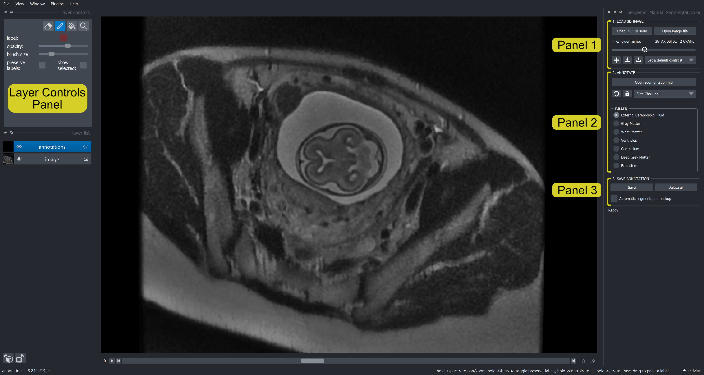

<div align="justify">
    
# HESPEROS PLUGIN FOR NAPARI

[](https://github.com/DBC/hesperos/raw/main/LICENSE)
[](https://pypi.org/project/hesperos)
[](https://python.org)
[](https://github.com/DBC/hesperos/actions)
[](https://codecov.io/gh/DBC/hesperos)
[](https://napari-hub.org/plugins/hesperos)

A Napari plugin for pre-defined manual segmentation or semi-automatic segmentation with a one-shot learning procedure. The objective was to simplify the interface as much as possible so that the user can concentrate on annotation tasks using a pen on a tablet, or a mouse on a computer. 
    
This [napari] plugin was generated with [Cookiecutter] using [@napari]'s [cookiecutter-napari-plugin] template.

    
# Table of Contents
- [Installation and Usage](#installation-and-usage)
    * [Automatic installation](#automatic-installation)
    * [Manual installation](#manual-installation)
    * [Upgrade Hesperos version](#upgrade-hesperos-version)
- [Hesperos: *Manual Segmentation and Correction* mode](#hesperos-manual-segmentation-and-correction-mode)
    * [Load and adjust your image](#load-and-adjust-your-image-use-panel-1)
    * [Layer controls](#layer-controls)
    * [Annotate your image](#annotate-your-image-use-panel-2)
    * [Save annotations](#save-annotations-use-panel-3)
- [Hesperos: *OneShot Segmentation* mode](#hesperos-oneshot-segmentation-mode)
    * [Load and adjust your image](#load-and-adjust-your-image-use-panel-1)
    * [Annotate your image](#annotate-your-image-use-panel-2)
    * [Run automatic segmentation](#run-automatic-segmentation-use-panel-3)
    * [Save annotations](#save-annotations-use-panel-4)

        
# Installation and Usage
The Hesperos plugin is designed to run on Windows (11 or less) and MacOS with Python 3.8 / 3.9 / 3.10.
     
    
## Automatic installation
1. Install [Anaconda] and unselect *Add to PATH*. Keep in mind the path where you choose to install anaconda.
2. Only download the *script_files* folder for [Windows](/script_files/for_Windows/) or [Macos](/script_files/for_Windows/). 
3. Add your Anaconda path in these script files:
    1. <ins>For Windows</ins>: 
    Right click on the .bat files (for [installation](/script_files/for_Windows/install_hesperos_env.bat) and [running](/script_files/for_Windows/run_hesperos.bat)) and select *Modify*. Change *PATH_TO_ADD* with your Anaconda path. Then save the changes.
        > for exemple:
        ```
        anaconda_dir=C:\Users\chgodard\anaconda3
        ```
    2. <ins>For Macos</ins>:
        1. Right click on the .command files (for [installation](/script_files/for_Macos/install_hesperos_env.command) and [running](/script_files/for_Macos/run_hesperos.command)) and select *Open with TextEdit*. Change *PATH_TO_ADD* with your Anaconda path. Then save the changes.
            > for exemple:
            ```
            source ~/opt/anaconda3/etc/profile.d/conda.sh
            ```
        2. In your terminal, change the permissions to allow the following .command files to be run (change *PATH* with the path of your .command files): 
            ``` 
            chmod u+x PATH/install_hesperos_env.command 
            chmod u+x PATH/run_hesperos.command 
            ```
4. Double click on the **install_hesperos_env file** to create a virtual environment in Anaconda with python 3.9 and Napari 0.4.14. 
    > /!\ The Hesperos plugin is not yet compatible with Napari versions superior to 0.4.14.
5. Double click on the **run_hesperos file** to run Napari from your virtual environment.
6. In Napari: 
    1. Go to *Plugins/Install Plugins...*
    2. Search for "hesperos" (it can take a while to load).
    3. Install the **hesperos** plugin.
    4. When the installation is done, close Napari. A restart of Napari is required to finish the plugin installation.
7. Double click on the **run_hesperos file** to run Napari.
8. In Napari, use the Hesperos plugin with *Plugins/hesperos*.

    
## Manual installation
1. Install [Anaconda] and unselect *Add to PATH*.
2. Open your Anaconda prompt command.
3. Create a virtual environment with Python 3.8 / 3.9 / 3.10:
    ```
    conda create -n hesperos_env python=3.9
    ```
4. Install the required Python packages in your virtual environment:
    ```
    conda activate hesperos_env
    conda install -c conda-forge napari=0.4.14 
    conda install -c anaconda pyqt
    pip install hesperos
    ```
    > /!\ Hesperos plugin is not yet compatible with napari version superior to 0.4.14.
5. Launch Napari:
    ```
    napari
    ```
    
## Upgrade Hesperos version
1. Double click on the **run_hesperos file** to run Napari. 
2. In Napari: 
    1. Go to *Plugins/Install Plugins...*
    2. Search for "hesperos" (it can take a while to load).
    3. Click on *Update* if a new version of Hesperos has been found. You can check the latest version of Hesperos in the [Napari Hub](https://www.napari-hub.org/plugins/hesperos).
    4. When the installation is done, close Napari. A restart of Napari is required to finish the plugin installation.
   
    
# Hesperos: *Manual Segmentation and Correction* mode
    
 The ***Manual Segmentation and Correction*** mode of the Hesperos plugin is a simplified and optimized interface to do basic 2D manual segmentation of several structures in a 3D image using a mouse or a stylet with a tablet.
    
    
 
    
## Load and adjust your image *(use Panel 1)*
The Hesperos plugin can be used with Digital Imaging and COmmunications in Medicine (DICOM), Neuroimaging Informatics Technology Initiative (NIfTI) or Tagged Image File Format (TIFF) images. To improve performances, use images that are located on your own disk.
 
1. To load data:
    - use the  button for *(.tiff, .tif, .nii or .nii.gz)* image files.
    - use the  button for a DICOM serie. /!\ Folder with multiple DICOM series is not supported.  
2. After the image has loaded, a slider appears that allows to zoom in/out: . Zooming is also possible with the  button in the layer controls panel. 
3. If your data is a DICOM serie, you have the possibility to directly change the contrast of the image (according to the Hounsfield Unit):
    - by choosing one of the two predefined contrasts: *CT bone* or *CT Soft* in .
    - by creating a custom default contrast with the  button and selecting *Custom Contrast*. Settings can be exported as a .json file with the  button.
    - by loading a saved default contrast with the  button and selecting *Custom Contrast*.
4. In the bottom left corner of the application you also have the possibility to: 
    - : change the order of the visible axis (for example go to sagittal, axial or coronal planes).
    - : transpose the 3D image on the current axis being displayed.


## Layer controls

When data is loading, two layers are created: the *`image`* layer and the *`annotations`* layer. Order in the layer list correspond to the overlayed order. By clicking on these layers you will have acces to different layer controls (at the top left corner of the application). All actions can be undone/redone with the Ctrl-Z/Shift-Ctrl-Z keyboard shortcuts. You can also hide a layer by clicking on its eye icon on the layer list.
    
    
<ins>For the *image* layer:</ins>
- *`opacity`*: a slider to control the global opacity of the layer.
- *`contrast limits`*: a double slider to manually control the contrast of the image (same as the  option for DICOM data).
    

<ins>For the *annotations* layer:</ins>
- : erase brush to erase all labels at once (if *`preserve labels`* is not selected) or only erase the selected label (if *`preserve labels`* is selected).
- : paint brush with the same color than the *`label`* rectangle.
- : fill bucket with the same color than the *`label`* rectangle.
- : select to zoom in and out with the mouse wheel (same as the zoom slider at the top right corner in Panel 1).
- *`label`*: a colored rectangle to represent the selected label.  
- *`opacity`*: a slider to control the global opacity of the layer.  
- *`brush size limits`*: a slider to control size of the paint/erase brush.    
- *`preserve labels`*: if selected, all actions are applied only on the selected label (see the *`label`* rectangle); if not selected, actions are applied on all labels.
- *`show selected`*: if selected, only the selected label will be display on the layer; if not selected, all labels are displayed.
   
    
>*Remark*: a second option for filling has been added
>1. Drawn the egde of a closed shape with the paint brush mode.  
>2. Double click to activate the fill bucket.  
>3. Click inside the closed area to fill it.  
>4. Double click on the filled area to deactivate the fill bucket and reactivate the paint brush mode.
    

## Annotate your image *(use Panel 2)*
    
Manual annotation and correction on the segmented file is done using the layer controls of the *`annotations`* layer. Click on the layer to display them. /!\ You have to choose a structure to start annotating *(see 2.)*.
1. To modify an existing segmentation, you can directy open the segmented file with the  button. The file needs to have the same dimensions as the original image. 
    > /!\ Only .tiff, .tif, .nii and .nii.gz files are supported as segmented files.  
    
2. Choose a structure to annotate in the drop-down menu
    - *`Fetus`*: to annotate pregnancy image.
    - *`Shoulder`*: to annotate bones and muscles for shoulder surgery.
    - *`Feta Challenge`*: to annotate fetal brain MRI with the same label than the FeTA Challenge (see ADD LIEN WEB).
    
> When selecting a structure, a new panel appears with a list of elements to annotate. Each element has its own label and color. Select one element in the list to automatically activate the paint brush mode with the corresponding color (color is updated in the *`label`* rectangle in the layer controls panel).
    
3. All actions can be undone with the  button or Ctrl-Z.
    
4. If you need to work on a specific slice of your 3D image, but also have to explore the volume to understand some complex structures, you can use the locking option to facilitate the annotation task.
    - <ins>To activate the functionality</ins>: 
        1. Go to the slice of interest.
        2. Click on the  button => will change the button to  and save the layer index.
        3. Scroll in the z-axis to explore the data (with the mouse wheel or the slider under the image).
        4. To go back to your slice of interest, click on the  button.
    - <ins>To deactivate the functionality</ins> (or change the locked slice index): 
        1. Go to the locked slice.
        2. Click on the  button  => change the button to  and "unlock" the slice.

    
## Save annotations *(use Panel 3)*
    
1. Annotations can be saved as .tif, .tiff, .nii or .nii.gz file with the  button in one of the two following saving mode:
    - *`Unique`*: segmented data is saved as a unique 3D image with corresponding label ids (1-2-3-...). This file can be re-opened in the application.
    - *`Several`*: segmented data is saved as several binary 3D images (0 or 255), one for each label id.
2. : delete annotation data.
3. *`Automatic segmentation backup`*: if selected, the segmentation data will be automatically saved as a unique 3D image when the image slice is changed.
    > /!\ This process can slow down the display if the image is large.
    
    
# Hesperos: *OneShot Segmentation* mode
    
 The ***OneShot Segmentation*** mode of the Hesperos plugin is a 2D version of the VoxelLearning method implemented in DIVA (see [our Github](https://github.com/DecBayComp/VoxelLearning) and the latest article [Guérinot, C., Marcon, V., Godard, C., et al. (2022). New Approach to Accelerated Image Annotation by Leveraging Virtual Reality and Cloud Computing. _Frontiers in Bioinformatics_. doi:10.3389/fbinf.2021.777101](https://www.frontiersin.org/articles/10.3389/fbinf.2021.777101/full)).
    

The principle is to accelerate the segmentation without prior information. The procedure consists of:
1. A **rapid tagging** of few pixels in the image with two labels: one for the structure of interest (named positive tags), and one for the other structures (named negative tags).
2. A **training** of a simple random forest classifier with these tagged pixels and their features (mean, gaussian, ...).
3. An **inference** of all the pixels of the image to automatically segment the structure of interest. The output is a probability image (0-255) of belonging to a specific class.
4. Iterative corrections if needed.
    


    
## Load and adjust your image *(use Panel 1)*
    
Same panel as the *Manual Segmentation and Correction* mode *(see [panel 1 description](#load-and-adjust-your-image-use-panel-1))*.
   
    
## Annotate your image *(use Panel 2)*
    
Annotations and corrections on the segmented file is done using the layer controls of the *`annotations`* layer. Click on the layer to display them. Only two labels are available: *`Structure of interest`* and *`Other`*. 

The rapid manual tagging step of the one-shot learning method aims to learn and attribute different features to each label.
 
To achieve that, the user has to:
- with the label *`Structure of interest`*, tag few pixels of the structure of interest.
- with the label *`Other`*, tag the greatest diversity of uninteresting structures in the 3D image (avoid tagging too much pixels).

> see the exemple image with *`Structure of interest`* label in red and *`Other`* label in cyan.
    
1. To modify an existing segmentation, you can directy open the segmented file with the  button. The file needs to have the same dimensions as the original image. 
    > /!\ Only .tiff, .tif, .nii and .nii.gz files are supported as segmented files. 
2. All actions can be undone with the  button or Ctrl-Z.
  
    
## Run automatic segmentation *(use Panel 3)*

From the previously tagged pixels, features are extracted and used to train a basic classifier : the Random Forest Classifier (RFC). When the training of the pixel classifier is done, it is applied to each pixel of the complete volume and outputs a probability to belong to the structure of interest.

To run training and inference, click on the  button:
1. You will be asked to save a .pckl file which corresponds to the model.
2. A new status will appears under the *Panel 4* : *`Computing...`*. You must wait for the message to change to: *`Ready`* before doing anything in the application (otherwise the application may freeze or crash).
3. When the processing is done, two new layers will appear:
    - the *`probabilities`* layer which corresponds to the direct probability (between 0 and 1) of a pixel to belong to the structure of interest. This layer is disabled by default, to enable it click on its eye icon in the layer list.
    - the *`segmented probabilities`* layer which corresponds to a binary image obtained from the probability image normed and thresholded according to a value manually defined with the *`Probability threshold`* slider: .

>Remark: If the output is not perfect, you have two possibilities to improve the result:
>1. Add some tags with the paint brush to take in consideration unintersting structures or add information in critical areas of your structure of interest (such as in thin sections). Then, run the training and inference process again. /!\ This will overwrite all previous segmentation data.
>2. Save your segmentation data and re-open it with the *Manual Annotation and Correction* mode of Hesperos to manually erase or add annotations.
    
    
## Save annotations *(use Panel 4)*
    
1. Segmented probabilites can be saved as .tif, .tiff, .nii or .nii.gz file with the  button. The image is saved as a unique 3D binary image (value 0 and 255). This file can be re-opened in the application for correction.
2. Probabilities can be saved as .tif, .tiff, .nii or .nii.gz file with the  button as a unique 3D image. The probabilities image is normed between 0 and 255.
3. : delete annotation data.
    

# License

Distributed under the terms of the [BSD-3] license, **Hesperos** is a free and open source software.

    
[napari]: https://github.com/napari/napari
[Cookiecutter]: https://github.com/audreyr/cookiecutter
[@napari]: https://github.com/napari
[BSD-3]: http://opensource.org/licenses/BSD-3-Clause
[cookiecutter-napari-plugin]: https://github.com/napari/cookiecutter-napari-plugin

[tox]: https://tox.readthedocs.io/en/latest/
[pip]: https://pypi.org/project/pip/
[PyPI]: https://pypi.org/
[Anaconda]: https://www.anaconda.com/products/distribution#Downloads
[VoxelLearning]: https://github.com/DecBayComp/VoxelLearning
